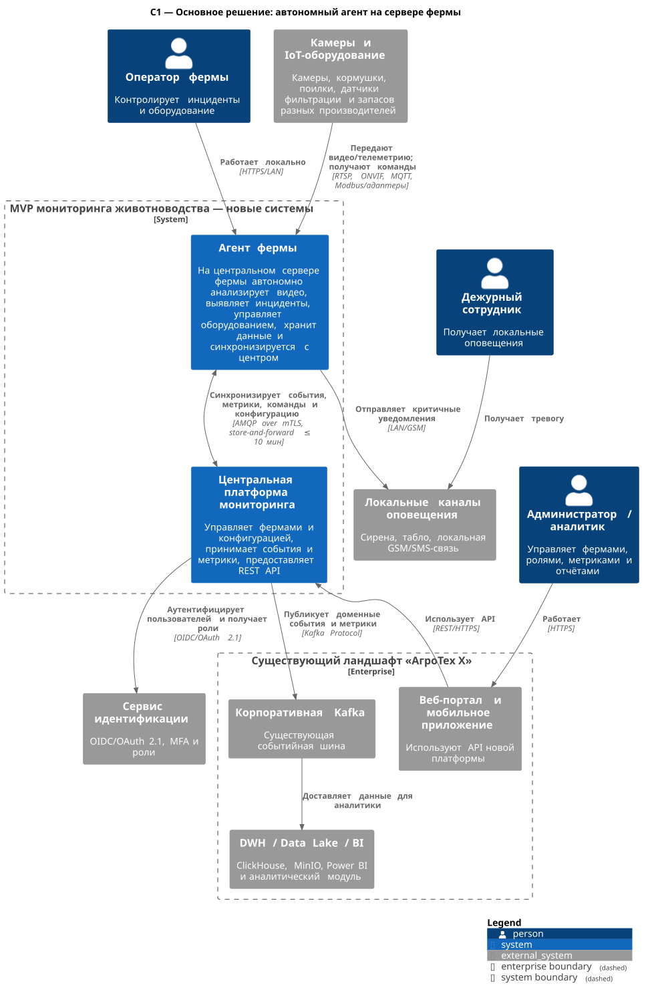
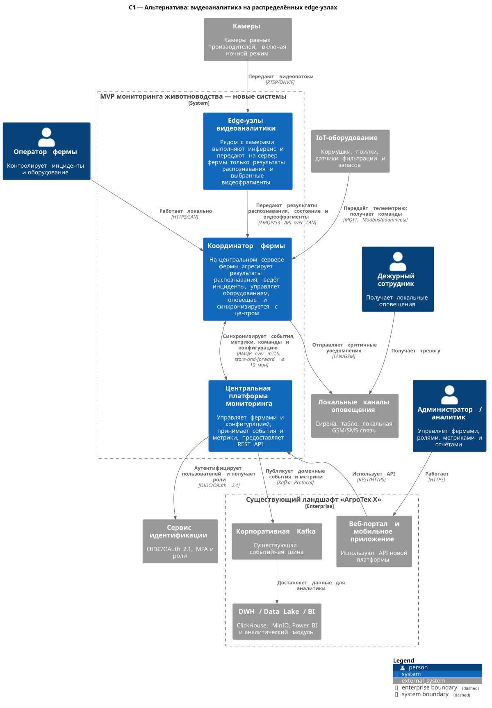

# ADR-001. Выбор общего направления архитектуры MVP мониторинга ферм

### Название задачи

Разработать основное и альтернативное архитектурные решения MVP платформы мониторинга свиноводческих ферм «АгроТех Х».

**Статус:** основное направление принято; варианты его контейнерной реализации рассматриваются в Task2.

### Автор

Александр Вафин

### Дата

16.07.2026

## Проблема и контекст

Система должна в реальном времени анализировать видео, выявлять опасные ситуации, управлять оборудованием разных производителей и продолжать работу без интернета. При этом на фермах нестабильная связь, а синхронизация с центральным офисом может задерживаться до 10 минут.

Главное архитектурное решение — где выполнять видеоинференс. Передача постоянных видеопотоков в головной офис не позволяет гарантировать автономность и задержку оповещения до 5 секунд. Поэтому оба допустимых варианта выполняют критическую аналитику внутри фермы, но по-разному размещают вычисления:

- основное решение — на одном центральном сервере фермы;
- альтернатива — на нескольких edge-узлах рядом с камерами, а сервер фермы выполняет координацию.

В центральном контуре переиспользуются существующие веб-/мобильные клиенты, Kafka, DWH, Data Lake и BI. Новыми являются агент/координатор фермы, центральная платформа мониторинга и адаптеры оборудования.

### Функциональные требования

| **№** | **Действующие лица или системы** | **Use Case** | **Описание** |
|:-----:| :- | :- | :- |
| UC-01 | Камеры, агент фермы, оператор | Обнаружить драку или беспокойство | 1. Камера передаёт поток локальному сервису видеоаналитики. 2. Модель формирует результат распознавания. 3. Сервис применяет правила и создаёт инцидент. 4. Оператор получает уведомление. |
| UC-02 | Камеры, агент фермы, дежурный | Обнаружить задавливание поросят | 1. Система выявляет опасную ситуацию. 2. Создаёт критический инцидент. 3. Не позднее 5 секунд включает локальное оповещение. |
| UC-03 | Камеры, агент фермы | Оценить состояние и поголовье | 1. Система оценивает количество животных и признаки болезни, гибели или беспокойства. 2. Сохраняет результат. 3. Передаёт аномалии и агрегаты оператору и в центр. |
| UC-04 | Оператор, кормушки, поилки | Управлять оборудованием | 1. Оператор или правило создаёт команду. 2. Агент выбирает адаптер производителя. 3. Выполняет команду. 4. Фиксирует результат или ошибку. |
| UC-05 | Датчики фильтрации, агент фермы | Контролировать воду | 1. Агент получает показатели фильтрации. 2. Сравнивает их с порогами. 3. При отклонении создаёт инцидент. |
| UC-06 | Датчики запасов, агент фермы | Контролировать и прогнозировать расход кормов | 1. Агент получает остатки и потребление. 2. Рассчитывает прогноз. 3. Формирует предупреждение о недостаточном запасе. |
| UC-07 | Администратор, центральная платформа, агент | Подключить ферму, устройство или метрику | 1. Администратор регистрирует объект и конфигурацию. 2. Центр публикует новую версию. 3. Агент применяет её после проверки. |
| UC-08 | Агент фермы, центральная платформа | Работать без интернета и синхронизироваться | 1. Агент продолжает локальную работу. 2. Сохраняет исходящие события в Outbox. 3. После восстановления связи передаёт их. 4. Центр принимает события идемпотентно. |
| UC-09 | Пользователь, сервис идентификации, платформа | Получить доступ по роли | 1. Пользователь аутентифицируется. 2. Платформа проверяет роль и доступные фермы. 3. Разрешает только допустимые действия. |
| UC-10 | Внешняя система, центральная платформа | Получить метрики | 1. Внешняя система обращается к API или подписывается на события. 2. Платформа передаёт базовые и зарегистрированные пользовательские метрики. |
| UC-11 | Веб-/мобильный клиент, пользователь, центральная платформа | Работать с системой через API | 1. Клиент получает токен пользователя. 2. Обращается к REST API. 3. Платформа проверяет роль и доступ к ферме. 4. Возвращает данные или принимает команду. |

### Нефункциональные требования

| **№** | **Требование** |
| :-: | :- |
| NFR-01 | Целевая доступность системы — 99,95%; центральный контур строится с резервированием, а локальный контур продолжает работу при недоступности центра. |
| NFR-02 | При заявленной нагрузке от фиксации нештатной ситуации до локального оповещения проходит не более 5 секунд. |
| NFR-03 | Видеоинференс выполняется внутри фермы с задержкой в миллисекундах; точный бюджет подтверждается нагрузочным тестом модели и оборудования. |
| NFR-04 | При исправной связи события синхронизируются с центром не позднее 10 минут; разрыв связи не приводит к потере подтверждённых данных. |
| NFR-05 | Центральная часть горизонтально масштабируется и не имеет архитектурного ограничения на число агентов. |
| NFR-06 | Новые производители устройств, типы инцидентов и метрики подключаются через адаптеры и версионируемые контракты без изменения несвязанных компонентов. |
| NFR-07 | Камеры поддерживают ночной режим; размещение минимизирует слепые зоны; рыбий глаз применяется только после проверки качества модели. |
| NFR-08 | Камеры подключаются преимущественно по Ethernet/PoE; для датчиков допускаются LoRaWAN, RS-485 и промышленный Ethernet; внешняя связь резервируется через 4G/5G. |
| NFR-09 | Пользователи используют OIDC/OAuth 2.1, MFA и RBAC; агенты — уникальные сертификаты и mTLS; административные действия аудируются. |
| NFR-10 | Система публикует технические метрики, структурированные логи и трассировку критического пути. |
| NFR-11 | В центр передаются события, метаданные и необходимые видеофрагменты; локальное видео ограничивается политикой хранения. |
| NFR-12 | Для каждого результата распознавания сохраняются уровень уверенности и версия модели. Допустимые для MVP ошибки учитываются при настройке порогов. |

## Ограничения и допущения

- Готовую нейросетевую модель предоставляет партнёр; её производительность и совместимость с целевым GPU необходимо проверить до закупки оборудования.
- Один центральный сервер фермы является аппаратной точкой отказа. Для приближения к 99,95% нужны UPS, RAID, мониторинг, резервный образ и регламент быстрой замены; остаточный риск согласуется с бизнесом.
- Из-за внешнего сходства животных MVP поддерживает подсчёт по зонам и локальное отслеживание особи, но не гарантирует её устойчивую идентификацию между разными камерами.

### Решение

Принять основным направлением автономный агент на центральном сервере каждой фермы. Агент выполняет видеоинференс, ведёт инциденты, управляет устройствами, оповещает сотрудников и хранит данные. Центральная платформа управляет конфигурацией и ролями, принимает события и метрики и предоставляет REST API. Обмен между агентом и центром асинхронный, с Transactional Outbox/Inbox и повторной доставкой.

Диаграмма:

Исходник: [C1-primary-edge.puml](C1-primary-edge.puml).

Логика выбора:

1. Критический путь не зависит от внешнего канала связи.
2. В центр передаются компактные события и выбранные видеофрагменты, а не постоянный видеопоток.
3. Один мощный сервер фермы проще обновлять и сопровождать, чем парк вычислительных edge-узлов.
4. Корпоративная Kafka и аналитический контур переиспользуются для событий и отчётности.
5. Разные протоколы оборудования изолируются адаптерами локального агента.

Компромиссы:

- серверу фермы требуются GPU и достаточная пропускная способность для всех камер;
- один сервер остаётся аппаратной точкой отказа;
- локальные данные и Outbox усложняют синхронизацию, но обеспечивают автономность;
- в центр попадает не всё видео, поэтому расследование ограничено сохранёнными фрагментами.

### Альтернативы

#### Распределённая видеоаналитика на edge-узлах

Инференс выполняется на нескольких edge-устройствах рядом с камерами. Центральный сервер фермы агрегирует результаты распознавания, ведёт инциденты, управляет IoT-оборудованием, оповещает сотрудников и синхронизируется с центральной платформой.

Диаграмма:

Исходник: [C1-alternative-distributed-edge.puml](C1-alternative-distributed-edge.puml).

Преимущества:

- меньшая задержка и меньший локальный видеотрафик;
- отказ одного edge-узла не останавливает аналитику всей фермы;
- вычисления масштабируются добавлением узлов вместе с камерами.

Компромиссы:

- требуется больше оборудования на каждой ферме;
- сложнее централизованно обновлять модель и диагностировать неоднородные устройства;
- модель должна поддерживать ограниченные ресурсы edge-устройств;
- объединение trackId и событий нескольких узлов сложнее.

Для MVP альтернатива не выбрана из-за стоимости и сложности эксплуатации, но она выполняет обязательные требования по автономности и задержкам и может быть пересмотрена после performance-тестов.

**Недостатки, ограничения, риски**

| Риск | Относится к | Последствие | Мера снижения                                                                                           |
| --- | --- | --- |---------------------------------------------------------------------------------------------------------|
| Модель не выдерживает нужное число потоков | Основное | Пропуск кадров или превышение 5 секунд | Нагрузочный эксперимент, аппаратное декодирование, лимит камер на сервер, приоритизация критических зон |
| Отказ единственного сервера фермы | Основное | Недоступна локальная аналитика | UPS, RAID, health monitoring, резервный образ и регламент замены                                        |
| Массовое обновление edge-узлов завершается частично | Альтернатива | На ферме работают разные версии модели | Подписанные атомарные обновления, canary rollout, контроль версии и rollback                            |
| Ограниченных ресурсов edge-узла недостаточно | Альтернатива | Снижается FPS и качество анализа | Benchmark на целевом устройстве, квоты потоков, аппаратное ускорение                                    |
| Outbox растёт при длительном отсутствии связи | Оба | Заканчивается диск | Квоты, приоритет событий, компрессия, политика хранения и мониторинг                                    |
| Повторная доставка создаёт дубликаты | Оба | Повторные инциденты или команды | eventId/commandId, Inbox, уникальные ограничения и идемпотентные обработчики                            |
| Нестабильная локальная сеть | Оба | Потеря кадров и телеметрии | Ethernet/PoE, промышленные протоколы, LoRaWAN и резервный канал                                         |
| Ночная съёмка, тени и искажения | Оба | Ложные события или пропуски | ИК-камеры, калибровка, пороги confidence и тестирование каждой зоны                                     |

## Последствия

Основное направление C1 принято. В Task2 оно раскрывается двумя контейнерными реализациями на сервере фермы: набором edge-микросервисов и модульным edge-агентом.
